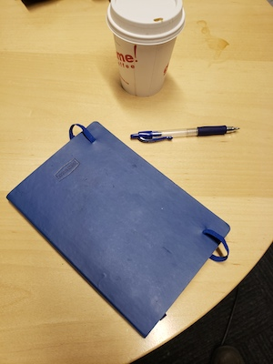

## CS 5670 - Intro to Computer Vision

### Spring 2023

### Programming Assignment #1 - Hough Transforms

##### Example 1

##### Results
|||||
|:--------:|:--------:|:--------:|:--------:|
| <figcaption> Gaussian Filtering </figcaption>|  <figcaption> Image Gradient (1/3) </figcaption>| <figcaption> Image Gradient (2/3) </figcaption> |  <figcaption> Image Gradient (3/3) </figcaption> |

|||
|:--------:|:--------:|
| <figcaption> Hough Voting </figcaption>|  <figcaption> Line Detection </figcaption> |

##### Example 2

|||
|:--------:|:--------:|
| <figcaption> Example 2 </figcaption>| <figcaption> Example 2 Line Detection </figcaption>|

### Programming Assignment #2 - Feature Detection and Matching
### Programming Assignment #3 - Two view and Photometric Stereo
### Programming Assignment #4 - Convolutional Neural Networks (CNNs) for Image Classification

